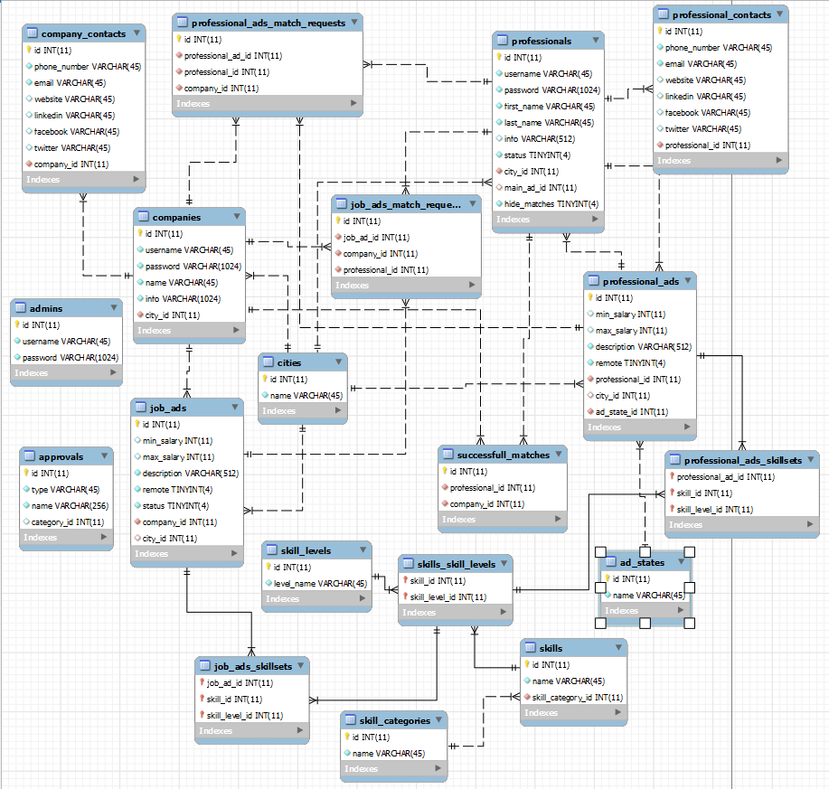

# JobMatch 

## Introduction

JobMatch is a RESTful Web API used to connect employers with employees. It is the final project of [Anastasiya Valcheva](https://gitlab.com/a-valcheva), [Konstantin Valchanov](https://gitlab.com/coreeshi), and [Yavor Chobanov](https://gitlab.com/javorchobanov), finishing their Alpha Python Track at Telerik Academy.

## Main functionalities

The main functionalities of JobMatch include:

* Registering and logging in as a professional, company or admin.
* After logging in and granting the needed authentication, both professionals and companies are allowed
  to create job ads. Job ads have different parameteters - salary range, description, demand/possibility for remote work, city, skill set (divided into categories, skills and skill levels). Both professionals and companies can view their own active and archived job ads, view a job ad by ID, update job ads, change their status, update their job ads's description, salary range аnd city. Admins have access to all of the data as well. 
* Search functionality - professionals and companies can search for suitable job ads based on skill set, salary range, city, preferences about remote work.
* Match functionality - professionals and companies can send a match request for an ad; the match can be confirmed by the owner of the ad. 
* Approval functionality - admins can approve requests from companies and professionals to add skills, skill categories and cities
* Notification functionality - after successfully creating, updating or deleting an ad the owner of the ad recieves an email notification. Email notifications are also sent on match request and confirmation of a match.

## Technologies
* Python
* SQL 
* FastAPI
* Mailjet

## Documentation 

Link to Swagger documentation - http://127.0.0.1:8000/docs

## Database

In order to create the database you need to use job_match_api.sql, for populating - insert_query.sql. An other way is to use only create_db_and_insert.sql. You could find these files in sql-db-scripts folder.

## Instructions on setting up the project

The project requires Visual Studio Code with installed Python, FastAPI and Mailjet. MariaDB server and MySQL Workbench are also required. The database.txt and mailjet_settings.txt files should be filled with the needed information - the database file with the database connection settings, and the mailjet file with the key and secret key from the mailjet profile. The uvicorn server should be started as well. 

                                                 

                                                 

                                                                    

#### Preset Cities Generator
This is a tiny console application with only one purpose - to create sql file for insertion of all cities in Bulgaria (unique names only) and it is external for JobMatch. It was used to insert the cities in our database before it was exported in the files mentioned above. The names are from the public database hub <a href="https://www.back4app.com/database/back4app/list-of-cities-in-bulgaria">back4app</a>

## Special thanks
The whole team gives our special thanks to our technical trainers at Telerik - Edward Evlogiev and Vladimir Venkov, for always being there when we needed them and helping us assimilate a ton of knowledge in the past 6 months, to our mentor - Todor Andonov, for advising us during our last weeks in the academy, and last but not least, to to our co-students from Alpha Python Track 40, for making the whole course a joyful experience.
